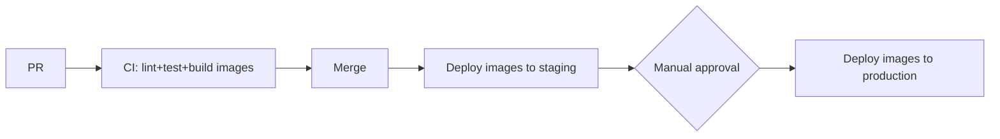

# Deployment

How verified code from [Testing](TESTING.md) reaches production for the
AI Document Processing Agent (API server, agent worker, and frontend).

## Environments

| Environment | URL | Purpose | Deploy Trigger |
| --- | --- | --- | --- |
| Dev | TBD | Local/shared development | Push to feature branch |
| Staging | TBD | Pre-production validation with real provider credentials | Merge to `main` |
| Production | TBD | Live system | Manual promotion from staging |

## Pipeline

- API server, agent worker, and frontend are each built as Docker images and deployed as independent containers, so the worker pool can scale independently (per [System Architecture](architecture/system-architecture.md), NFR-21).
- CI builds and tags one image per component on every merge to `main`; the same images are promoted from staging to production rather than rebuilt, so what's tested is what ships.
- Database migrations run as a separate, ordered step before the new API/worker container versions are rolled out.

## Rollback Plan

- Previous container image/binary is kept available for immediate redeploy.
- Migrations are written to be backward-compatible for one release where feasible, so a rollback does not require a down-migration on the hot path.

## Release Checklist

- [ ] Migrations applied and verified against staging.
- [ ] Config/secrets (LLM/OCR provider keys, DB credentials) updated for the target environment.
- [ ] Health checks passing for API server and agent worker.
- [ ] Agent iteration cap and confidence thresholds confirmed for the release.
- [ ] Rollback plan confirmed.

---

Next stage: [Operations](OPERATIONS.md)
