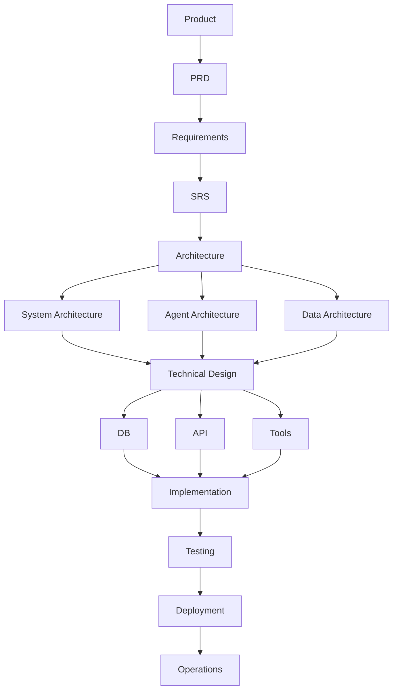

# Software Development Lifecycle (SDLC)

This document describes the stages this project moves through, from initial
product idea to live operations, and the artifacts produced at each stage.

## Flow

## Stages

| Stage | Description | Doc |
|---|---|---|
| **Product** | The product vision or idea driving the work. | Vision doc, roadmap |
| **PRD** | Product Requirements Document — what to build and why, from a product perspective. | [PRD.md](PRD.md) |
| **Requirements** | Functional and non-functional requirements derived from the PRD. | [REQUIREMENTS.md](REQUIREMENTS.md) |
| **SRS** | Software Requirements Specification — formalized, testable requirements. | [SRS.md](SRS.md) |
| **Architecture** | High-level system design, split into three concerns: | — |
| ↳ System Architecture | Overall system topology, services, infrastructure. | [architecture/system-architecture.md](architecture/system-architecture.md) |
| ↳ Agent Architecture | Design of autonomous/agentic components, if applicable. | [architecture/agent-architecture.md](architecture/agent-architecture.md) |
| ↳ Data Architecture | Data models, storage, flow, and ownership. | [architecture/data-architecture.md](architecture/data-architecture.md) |
| **Technical Design** | Concrete design decisions feeding into implementation: | — |
| ↳ API | Endpoint contracts, request/response shapes. | [technical-design/api.md](technical-design/api.md) |
| ↳ DB | Database schema and migrations. | [technical-design/db.md](technical-design/db.md) |
| ↳ Tools | Supporting tooling, libraries, integrations. | [technical-design/tools.md](technical-design/tools.md) |
| **Implementation** | Writing the code. | [IMPLEMENTATION.md](IMPLEMENTATION.md) |
| **Testing** | Verifying correctness (unit, integration, e2e). | [TESTING.md](TESTING.md) |
| **Deployment** | Shipping the code to an environment. | [DEPLOYMENT.md](DEPLOYMENT.md) |
| **Operations** | Running and maintaining the live system. | [OPERATIONS.md](OPERATIONS.md) |

## Notes

- The **Architecture** stage fans out into three parallel concerns (System,
  Agent, Data) that converge back into a single **Technical Design** stage.
- **Technical Design** likewise fans out into API, DB, and Tools before
  converging into **Implementation**.
- Everything downstream of Implementation (Testing → Deployment →
  Operations) is linear.
