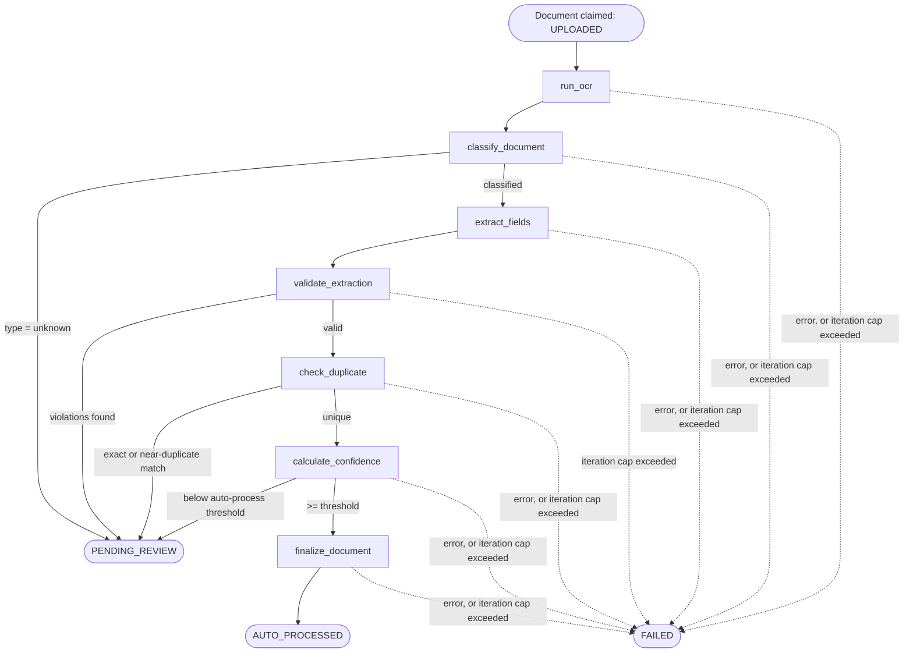

# Agent Architecture

Describes the AI Agent that drives document processing: how it selects
tools, what tools it has access to, and the guardrails that bound its
behavior (FR-17–FR-22, NFR-7, NFR-8, NFR-13).

## Overview

Each document processing run is a single **Agent Run**: a bounded loop
that starts when a document is enqueued and ends when the document
reaches a terminal state (`AUTO_PROCESSED`, `PENDING_REVIEW`, or
`FAILED`). The agent reasons over the current document state and selects
the next tool to invoke from a fixed registry — it never executes
arbitrary code or unregistered actions (NFR-7).

## Agents

| Agent | Purpose | Trigger | Inputs | Outputs |
| --- | --- | --- | --- | --- |
| Document Processing Agent | Drive a document from `UPLOADED` to a terminal state via classify/extract/validate/score/route | Document enqueued after upload | Document ID, document state | Updated document state, tool execution records |

## Agent Lifecycle

At each step the agent records a **Tool Execution** (input, output,
status, duration) and re-evaluates document state before selecting the
next tool. Routing to `PENDING_REVIEW` is a normal, successful outcome
(the agent run finishes `COMPLETED`, not `FAILED`) — only an
unrecoverable error or exceeding `max_agent_iterations` fails the run
(FR-20, FR-21, NFR-13).

## Tools / Capabilities Available to Agents

| Tool | Purpose | High-risk? |
| --- | --- | --- |
| `run_ocr` | Extract raw text from an image/PDF document | No |
| `classify_document` | Predict document type + confidence | No |
| `extract_fields` | Extract structured fields per the document type's schema | No |
| `validate_extraction` | Run field/business validation rules | No |
| `check_duplicate` | Detect exact/near-duplicate documents | No |
| `calculate_confidence` | Aggregate classification + field confidence into an overall score | No |
| `retrieve_policy` (RAG) | Retrieve relevant policy/knowledge snippets from the vector store to inform extraction or validation | No |
| `route_to_review` | Create a review task and pause automated processing | No |
| `finalize_document` | Mark a document as auto-processed and persist approved data | Yes — requires confidence + validation to pass |

Tools are registered in a central **Tool Registry** with a declared input
schema, output schema, and timeout. The agent can only invoke tools
present in the registry (NFR-7); each invocation has a configurable
timeout (NFR-3) and is retried according to a bounded policy only when
the tool is marked idempotent/retryable (NFR-11).

## Guardrails & Failure Modes

- **Tool allowlist:** the agent may only call registered tools — no arbitrary code execution (NFR-7, PRD Out of Scope).
- **Iteration cap:** every agent run has a maximum iteration count; exceeding it fails the run rather than looping indefinitely (FR-21, NFR-13).
- **Human approval for high-risk actions:** `finalize_document` (committing data as approved) and any future destructive action require the preceding validation/confidence gates to pass, or the run is routed to human review instead (NFR-8).
- **Timeouts:** each tool call has a bounded execution time; a timeout is recorded as a failed tool execution and counts toward the iteration cap (NFR-3).
- **Idempotency:** re-processing the same document (e.g. after a retry) must not create duplicate side effects — tool executions are keyed by agent run + step (NFR-12).
- **Full traceability:** every tool execution and state transition is recorded against the agent run's trace/execution ID for audit and debugging (NFR-10, NFR-18, NFR-19).

---

See also: [System Architecture](system-architecture.md) · [Data Architecture](data-architecture.md)
Next stage: [Technical Design](../technical-design/api.md)
