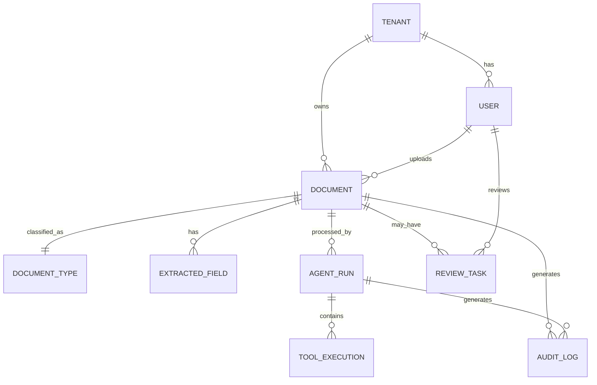

# Data Architecture

Describes the data model backing the AI Document Processing Agent:
entities, ownership, and flow. All tables carry a `tenant_id` for future
multi-tenancy even though the MVP runs single-tenant (SRS Scope).

## Data Model Overview

## Entities

| Entity | Description | Owner Service |
| --- | --- | --- |
| Tenant | Organization/workspace boundary (multi-tenant-ready, single row in MVP) | API Server |
| User | Authenticated user with a role (uploader, reviewer, admin) | API Server |
| Document | An uploaded file and its processing status | API Server / Agent Worker |
| DocumentType | Supported type (`invoice`, `receipt`, `cv`) with its field schema and validation rules | API Server |
| ExtractedField | A single extracted field (name, value, confidence) for a document | Agent Worker |
| AgentRun | One execution of the agent workflow for a document, with status and iteration count | Agent Worker |
| ToolExecution | A single tool invocation within an agent run (input, output, status, duration) | Agent Worker |
| ReviewTask | A human review request for a document, with decision and corrections | API Server |
| AuditLog | Immutable, append-only record of significant actions | API Server / Agent Worker |

## Data Flow

1. User uploads a document via the Frontend → API Server; the original file is written to Object Storage and a `Document` row is created (`UPLOADED`).
2. API Server enqueues a processing job; the Agent Worker dequeues it and creates an `AgentRun`.
3. Each tool the agent invokes writes a `ToolExecution` row and updates the `Document` status and/or `ExtractedField` rows.
4. If confidence/validation/duplicate checks fail, a `ReviewTask` is created and the document moves to `PENDING_REVIEW`; a reviewer's decision updates `ExtractedField`/`Document` and closes the task.
5. Every state transition and reviewer action appends an `AuditLog` row — never mutated, only inserted.

## Storage

| Store | Purpose | Technology |
| --- | --- | --- |
| PostgreSQL | Documents, extractions, agent runs, tool executions, reviews, audit log | PostgreSQL |
| pgvector | Embeddings for RAG policy/knowledge retrieval | PostgreSQL + pgvector extension |
| Object Storage | Original uploaded files | Local disk (dev) / S3-compatible (prod) |

## Data Retention & Privacy

- Uploaded documents may contain PII (e.g. CVs); access is restricted to authorized users and reviewers within the owning tenant (NFR-5).
- Audit log entries are retained indefinitely for traceability (NFR-10); retention policy for original files and extracted PII is an open question (see PRD Open Questions).

---

See also: [System Architecture](system-architecture.md) · [Agent Architecture](agent-architecture.md)
Next stage: [Technical Design → DB](../technical-design/db.md)
