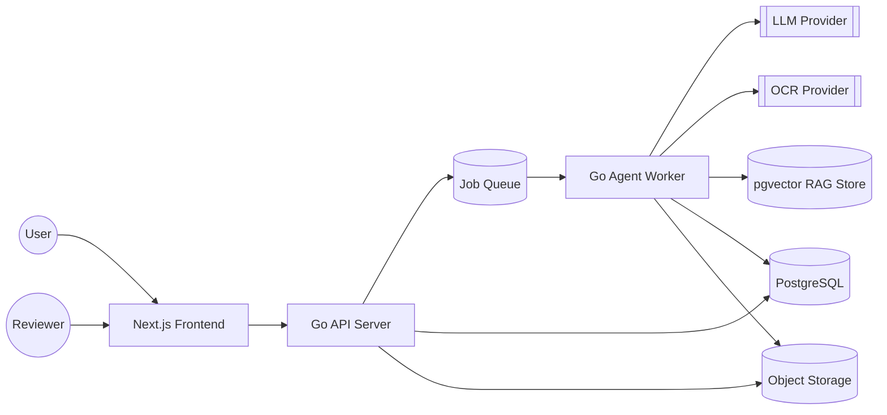

# System Architecture

Derived from the [SRS](../SRS.md). Describes the overall topology of the
AI Document Processing Agent platform: a Go backend running the AI Agent
and API, backed by PostgreSQL, with a Next.js frontend for upload and
human review.

## Context Diagram

## Components

| Component | Responsibility | Tech |
| --- | --- | --- |
| Frontend | Upload UI, processing status, review queue, audit views | Next.js (TypeScript) |
| API Server | AuthN/AuthZ, upload endpoint, document/review/audit REST API, enqueues processing jobs | Go (chi/gin), pgx |
| Agent Worker | Runs the AI Agent loop: classify → extract → validate → score → route | Go, background worker pool |
| Job Queue | Decouples upload from asynchronous agent processing (FR-26, NFR-15) | Postgres-backed queue (e.g. river/asynq) or Redis |
| PostgreSQL | System of record: documents, extractions, agent runs, reviews, audit log | PostgreSQL |
| Object Storage | Stores original uploaded files | Local disk (dev) / S3-compatible (prod) |
| LLM Provider | Classification, extraction, reasoning | External API (provider TBD, see PRD open questions) |
| OCR Provider | Text extraction from images/PDFs | External API or local engine (TBD) |
| Vector Store | RAG retrieval of policies/knowledge (FR-24) | pgvector extension on PostgreSQL |

## Deployment Topology

- Every component (API Server, Agent Worker, Frontend, PostgreSQL, Job Queue) runs as a Docker container; the API Server and Agent Worker are independently deployable images, allowing the worker pool to scale separately from API traffic (supports NFR-15, NFR-21).
- Local development runs the full stack via Docker Compose, so a new contributor can reproduce the system with a single command (NFR-22) — see [Tools](../technical-design/tools.md).
- Single-tenant PostgreSQL instance for the MVP; schema carries a `tenant_id` on all tables to avoid a rewrite when multi-tenancy is introduced (per SRS Scope).
- Object storage is abstracted behind an interface so local disk (dev) and S3-compatible storage (prod) are interchangeable (NFR-17, PRD open question).

## Cross-Cutting Concerns

- **Auth:** Token-based authentication (e.g. JWT) on all API routes except health checks; authorization enforced per document/tenant (NFR-4, NFR-5).
- **Logging/Observability:** Structured logging with a trace/execution ID per agent run, propagated through tool executions (NFR-18, NFR-19).
- **Config/Secrets:** Environment variables / secret manager; no credentials in source (NFR-9).
- **Error handling:** Tool and agent-run failures are caught, recorded, and either retried (bounded) or routed to human review — never silently dropped (NFR-11, NFR-13).

---

See also: [Agent Architecture](agent-architecture.md) · [Data Architecture](data-architecture.md)
Next stage: [Technical Design](../technical-design/api.md)
