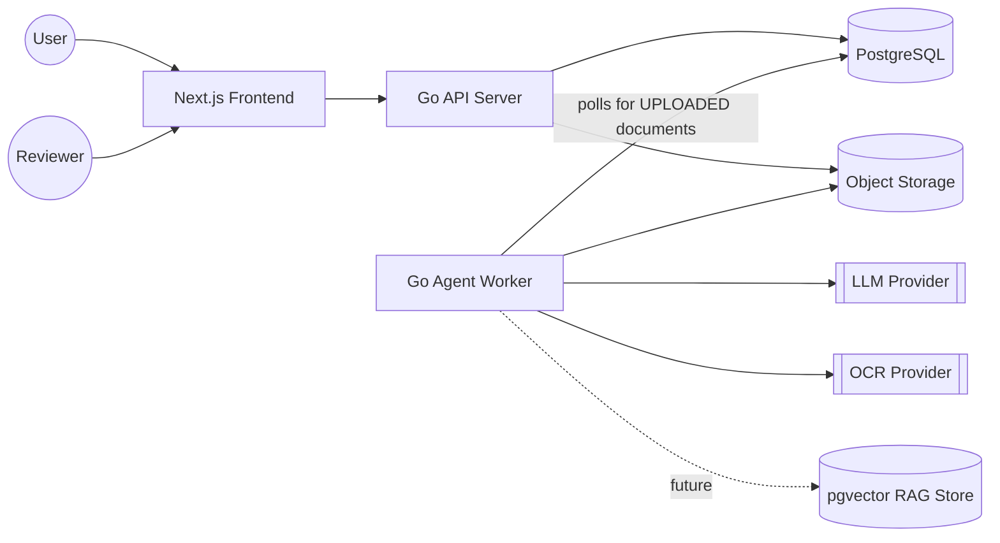

# System Architecture

Derived from the [SRS](../SRS.md). Describes the overall topology of the
AI Document Processing Agent platform: a Go backend running the AI Agent
and API, backed by PostgreSQL, with a Next.js frontend for upload and
human review.

## Context Diagram

## Components

| Component | Responsibility | Tech |
| --- | --- | --- |
| Frontend | Upload UI, processing status, review queue, audit views | Next.js (TypeScript) |
| API Server | AuthN/AuthZ, upload endpoint, document/review/audit REST API | Go (chi), pgx |
| Agent Worker | Polls for `UPLOADED` documents and runs the AI Agent loop: OCR → classify → extract → validate → dedup → score → route | Go, poll-and-backoff loop (no separate queue service — see below) |
| PostgreSQL | System of record: documents, extractions, agent runs, reviews, audit log. Also doubles as the job queue: the worker claims the oldest `UPLOADED` document with `SELECT ... FOR UPDATE SKIP LOCKED`, so concurrent worker instances never double-process one | PostgreSQL |
| Object Storage | Stores original uploaded files | Local disk (dev) / S3-compatible (prod) |
| LLM Provider | Classification, extraction, reasoning | Pluggable `Provider` interface; stub implementation ships by default (see PRD open questions) |
| OCR Provider | Text extraction from images/PDFs | Pluggable `Provider` interface; stub implementation ships by default (see PRD open questions) |
| Vector Store | RAG retrieval of policies/knowledge (FR-24) | pgvector extension on PostgreSQL — schema exists (`knowledge_chunks`), retrieval tool not yet implemented |

A dedicated job queue (Postgres-backed or Redis) was considered but
isn't needed at this scale: `SKIP LOCKED` claiming against the
`documents` table already gives safe concurrent dequeuing without an
extra moving part. Revisit if worker throughput ever becomes the
bottleneck.

## Deployment Topology

- Every component (API Server, Agent Worker, Frontend, PostgreSQL) runs as a Docker container; the API Server and Agent Worker are independently deployable images, allowing the worker pool to scale separately from API traffic (supports NFR-15, NFR-21).
- Local development runs the full stack via Docker Compose, so a new contributor can reproduce the system with a single command (NFR-22) — see [Tools](../technical-design/tools.md).
- Single-tenant PostgreSQL instance for the MVP; schema carries a `tenant_id` on all tables to avoid a rewrite when multi-tenancy is introduced (per SRS Scope).
- Object storage is abstracted behind an interface so local disk (dev) and S3-compatible storage (prod) are interchangeable (NFR-17, PRD open question).

## Cross-Cutting Concerns

- **Auth:** Per-user opaque bearer tokens (not JWT) on all API routes except `/healthz`; only each token's SHA-256 hash is persisted. Authorization is enforced per document (tenant-scoped queries) and per role (`RequireRole`); true multi-tenant isolation (a second tenant to actually enforce boundaries against) remains a PRD Open Question (NFR-4, NFR-5). See [API design](../technical-design/api.md).
- **Logging/Observability:** Structured logging with a trace/execution ID per agent run, propagated through tool executions (NFR-18, NFR-19).
- **Config/Secrets:** Environment variables / secret manager; no credentials in source (NFR-9).
- **Error handling:** Tool and agent-run failures are caught, recorded, and either retried (bounded) or routed to human review — never silently dropped (NFR-11, NFR-13).

---

See also: [Agent Architecture](agent-architecture.md) · [Data Architecture](data-architecture.md)
Next stage: [Technical Design](../technical-design/api.md)
