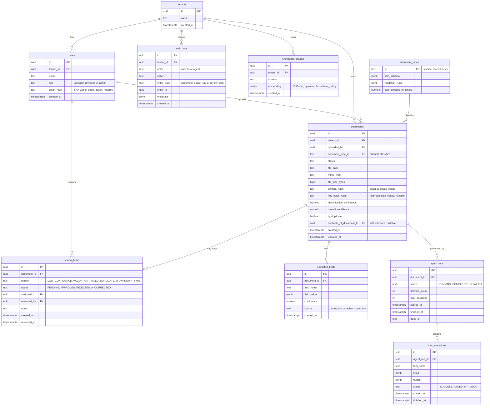

# Database Design

Concrete PostgreSQL schema implementing the [Data Architecture](../architecture/data-architecture.md).
Every table carries `tenant_id` to keep the schema multi-tenant-ready
(SRS Scope) even though the MVP runs single-tenant.

## Engine

- PostgreSQL 15+, with the `pgvector` extension enabled for RAG embeddings (FR-24).
- Migrations managed with a Go migration tool (e.g. `golang-migrate` or `atlas`); see [Tools](tools.md).

## Schema

### Table: `tenants`

| Column | Type | Constraints | Description |
| --- | --- | --- | --- |
| id | uuid | PK | Tenant identifier |
| name | text | NOT NULL | Tenant/organization name |
| created_at | timestamptz | NOT NULL DEFAULT now() | |

### Table: `users`

| Column | Type | Constraints | Description |
| --- | --- | --- | --- |
| id | uuid | PK | User identifier |
| tenant_id | uuid | FK → tenants.id, NOT NULL | |
| email | text | UNIQUE, NOT NULL | |
| role | text | NOT NULL | `uploader`, `reviewer`, `admin` |
| token_hash | text | UNIQUE (partial, NULL allowed), NULL | SHA-256 hash of the user's bearer token — the token itself is never stored |
| created_at | timestamptz | NOT NULL DEFAULT now() | |

### Table: `document_types`

| Column | Type | Constraints | Description |
| --- | --- | --- | --- |
| id | text | PK | `invoice`, `receipt`, `cv` |
| field_schema | jsonb | NOT NULL | Expected fields and types for extraction |
| validation_rules | jsonb | NOT NULL | Rule set evaluated during validation |
| auto_process_threshold | numeric | NOT NULL | Confidence threshold for auto-processing (FR-25) |

### Table: `documents`

| Column | Type | Constraints | Description |
| --- | --- | --- | --- |
| id | uuid | PK | Document identifier |
| tenant_id | uuid | FK → tenants.id, NOT NULL | |
| uploaded_by | uuid | FK → users.id, NOT NULL | |
| document_type_id | text | FK → document_types.id, NULL until classified | |
| status | text | NOT NULL | `UPLOADED`, `CLASSIFIED`, `EXTRACTED`, `VALIDATED`, `PENDING_REVIEW`, `AUTO_PROCESSED`, `REVIEWED`, `FAILED` |
| file_path | text | NOT NULL | Object storage key |
| mime_type | text | NOT NULL | |
| file_size_bytes | bigint | NOT NULL | |
| content_hash | text | NOT NULL | Used for exact-duplicate detection (FR-10) |
| key_fields_hash | text | NULL | Hash of extracted key fields, used for near-duplicate detection once extraction completes with no missing fields (FR-10) |
| classification_confidence | numeric | NULL | |
| overall_confidence | numeric | NULL | |
| is_duplicate | boolean | NOT NULL DEFAULT false | |
| duplicate_of_document_id | uuid | FK → documents.id, NULL | |
| created_at | timestamptz | NOT NULL DEFAULT now() | |
| updated_at | timestamptz | NOT NULL DEFAULT now() | |

### Table: `extracted_fields`

| Column | Type | Constraints | Description |
| --- | --- | --- | --- |
| id | uuid | PK | |
| document_id | uuid | FK → documents.id, NOT NULL | |
| field_name | text | NOT NULL | |
| field_value | jsonb | NOT NULL | |
| confidence | numeric | NOT NULL | |
| source | text | NOT NULL | `extraction` or `review_correction` |
| created_at | timestamptz | NOT NULL DEFAULT now() | |

### Table: `agent_runs`

| Column | Type | Constraints | Description |
| --- | --- | --- | --- |
| id | uuid | PK | |
| document_id | uuid | FK → documents.id, NOT NULL | |
| status | text | NOT NULL | `RUNNING`, `COMPLETED`, `FAILED` |
| iteration_count | int | NOT NULL DEFAULT 0 | |
| max_iterations | int | NOT NULL | Configured cap (FR-21) |
| started_at | timestamptz | NOT NULL DEFAULT now() | |
| finished_at | timestamptz | NULL | |
| trace_id | text | NOT NULL | Correlates logs/metrics (NFR-19) |

### Table: `tool_executions`

| Column | Type | Constraints | Description |
| --- | --- | --- | --- |
| id | uuid | PK | |
| agent_run_id | uuid | FK → agent_runs.id, NOT NULL | |
| tool_name | text | NOT NULL | Must match [Agent Architecture](../architecture/agent-architecture.md) tool registry |
| input | jsonb | NOT NULL | |
| output | jsonb | NULL | |
| status | text | NOT NULL | `SUCCESS`, `FAILED`, `TIMEOUT` |
| started_at | timestamptz | NOT NULL DEFAULT now() | |
| finished_at | timestamptz | NULL | |

### Table: `review_tasks`

| Column | Type | Constraints | Description |
| --- | --- | --- | --- |
| id | uuid | PK | |
| document_id | uuid | FK → documents.id, NOT NULL | |
| reason | text | NOT NULL | `LOW_CONFIDENCE`, `VALIDATION_FAILED`, `DUPLICATE`, `UNKNOWN_TYPE` |
| status | text | NOT NULL | `PENDING`, `APPROVED`, `REJECTED`, `CORRECTED` |
| assigned_to | uuid | FK → users.id, NULL | |
| reviewed_by | uuid | FK → users.id, NULL | |
| notes | text | NULL | |
| created_at | timestamptz | NOT NULL DEFAULT now() | |
| reviewed_at | timestamptz | NULL | |

### Table: `audit_logs`

| Column | Type | Constraints | Description |
| --- | --- | --- | --- |
| id | uuid | PK | |
| tenant_id | uuid | FK → tenants.id, NOT NULL | |
| actor | text | NOT NULL | User ID or `agent` |
| action | text | NOT NULL | e.g. `document.uploaded`, `tool.executed`, `review.corrected` |
| entity_type | text | NOT NULL | `document`, `agent_run`, `review_task` |
| entity_id | uuid | NOT NULL | |
| metadata | jsonb | NULL | |
| created_at | timestamptz | NOT NULL DEFAULT now() | Append-only; no updates (NFR-10) |

### Table: `knowledge_chunks`

| Column | Type | Constraints | Description |
| --- | --- | --- | --- |
| id | uuid | PK | |
| tenant_id | uuid | FK → tenants.id, NOT NULL | |
| content | text | NOT NULL | |
| embedding | vector(1536) | NOT NULL | pgvector column for `retrieve_policy` (FR-24) |
| created_at | timestamptz | NOT NULL DEFAULT now() | |

## Indexes

| Table | Columns | Type | Reason |
| --- | --- | --- | --- |
| documents | (tenant_id, status) | btree | Filter documents by status per tenant |
| documents | (content_hash) | btree | Exact-duplicate lookup (FR-10) |
| documents | (tenant_id, document_type_id, key_fields_hash) WHERE key_fields_hash IS NOT NULL | btree, partial | Near-duplicate lookup (FR-10) |
| extracted_fields | (document_id) | btree | Load all fields for a document |
| agent_runs | (document_id) | btree | Load runs for a document |
| tool_executions | (agent_run_id) | btree | Load executions for a run |
| review_tasks | (status, assigned_to) | btree | Review queue lookups |
| audit_logs | (entity_type, entity_id) | btree | Audit history lookups |
| knowledge_chunks | (embedding) | ivfflat/hnsw | Vector similarity search |

## Migrations

- Tooling: Go migration library, run as part of the API server's startup or a dedicated `migrate` command.
- Location: `db/migrations/` (proposed), one up/down pair per change, applied sequentially in CI/CD.

## Relationships

`documents.duplicate_of_document_id` is a nullable self-reference (set
by `check_duplicate` when a document matches an earlier one, exactly or
by key fields) — omitted from the diagram above as an edge to keep it
readable, but present as a column.

---

See also: [API](api.md) · [Tools](tools.md)
Next stage: [Implementation](../IMPLEMENTATION.md)
